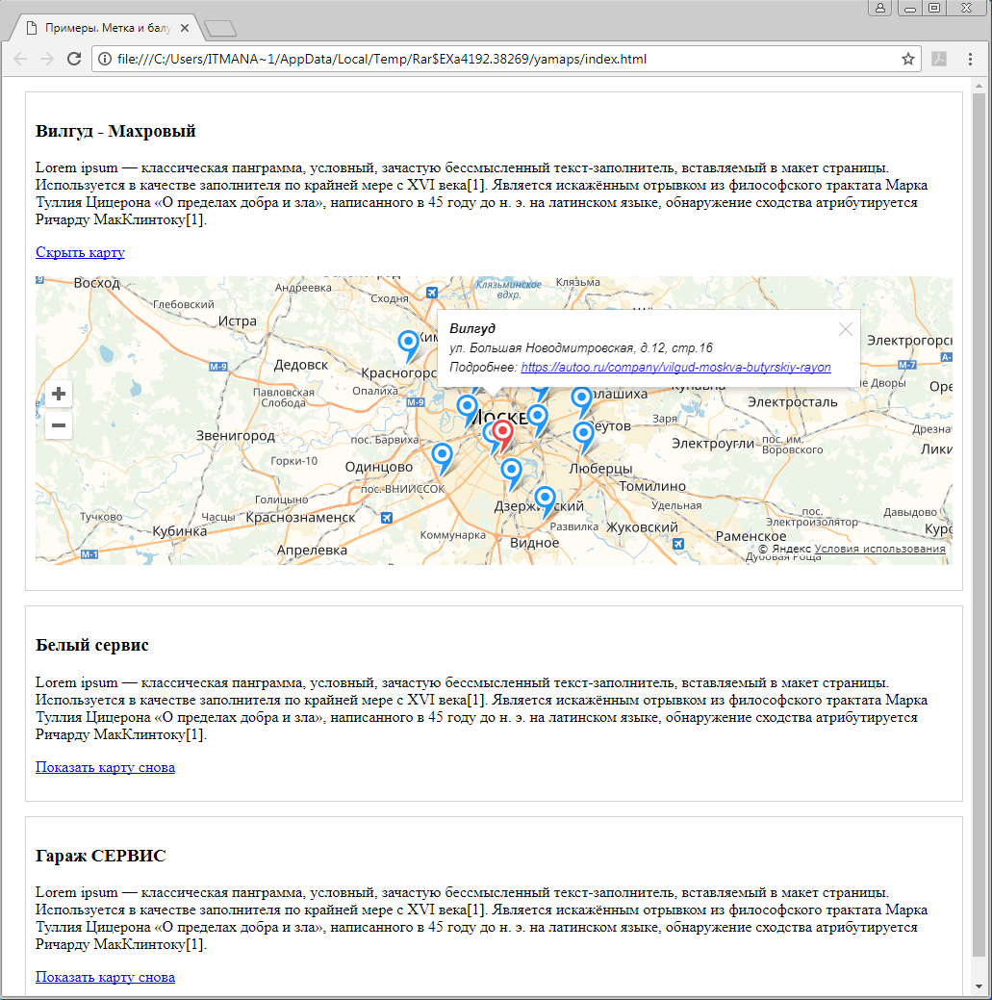

# AUTOO

***

### Что включено

- [Gulp.js](https://github.com/gulpjs/gulp)
- [Webpack](https://github.com/webpack/webpack)
- [Babel](https://github.com/babel/babel)
- [ESLint](https://github.com/eslint/eslint) и [Airbnb's base config](https://www.npmjs.com/package/eslint-config-airbnb-base)
- [Pug](https://github.com/pugjs/pug)
- [Sass](http://sass-lang.com) и [PostCSS](https://github.com/postcss/postcss)' [Autoprefixer](https://github.com/postcss/autoprefixer)

### Установка и сборка

```js
npm i // - установка зависимостей
npm start // - запуск девелоперской версии на локальном сервере
npm run build // - запуск сборки для продакшна
npm run preview // - запуск сборки для продакшна на локальном сервере
```

### О задаче

1. Выводим карточки 3-х групп автосервисов. В каждой карточке отображается название, описание и кнопка “показать другие автосервисы”.
2. При нажатии на кнопку - открывается карта.
3. Одновременно может быть открыта только одна карта.
4. На карте отмечены дочерние компании.
5. При раскрытии карты необходимо установить такой масштаб, чтобы все автосервисы поместились.
6. Один из автосервисов отмечен на карте другим цветом.
7. При клике на автосервис, открывается маленькое модальное окно внутри карты (с использованием апи).
8. Модальное окно содержит:
+ название
+ адрес
+ ссылку на страницу
+ кнопка закрыть.
9. На карте не отображается никаких элементов управления, кроме:
+ кнопки увеличения и уменьшения масштаба.
+ ссылка на пользовательское соглашение в Яндексе.


***
### Лайф версия доступна по [ссылке](https://topus009.github.io/autoo/)

***
